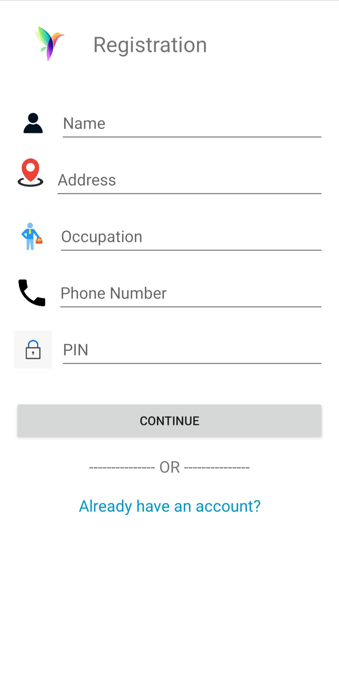
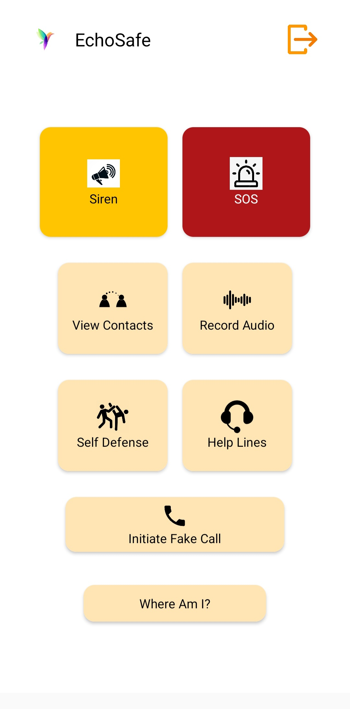

# 🔔 EchoSafe - A Woman Safety App
## Overview
EchoSafe is a comprehensive women's safety application designed to provide emergency assistance and essential security features. The app empowers users to take immediate action in critical situations by triggering a loud siren, sharing their real-time location, and storing emergency contacts for quick access and much more.

## Tech Stack
- **Android Studio** 
- **Java** 
- **Firebase**

## Features
### 1. Registration

  

  
### 2. Login

  

   
### 3. Homepage with the main features

  

### 4. Siren
Plays a loud siren to create an attraction to the victim(s)

### 5. SOS Button
Send a text message to the contacts with the current location of the user.

  

### 6. Add (upto 5), view and Delete Emergency Contacts
   

  

8. Record Audio
9. A guide to self defense
10. National helplines
11. Initiaiting Fake Call
